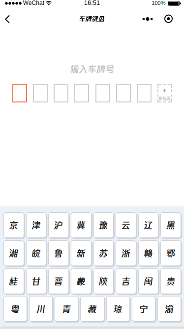
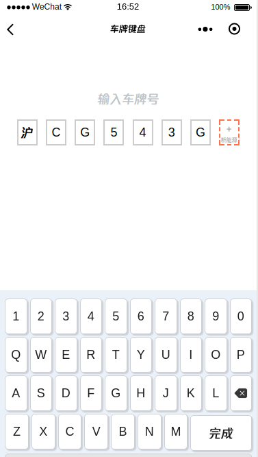

# mpvue-keyboard 基于 mpvue的小程序虚拟键盘组件

## 效果图



## 属性

| 名称              | 类型           | 默认值        | 描述               |
| -----------------|--------------- | ------------- | ----------------  |
| title        | String         | 输入或拍照录入车牌             | 自定义 标题  |
| bgcolor          | String         | #ffffff             | 自定义背景颜色           |
| baseBorColor           | String         | #cccccc   | 自定义输入格子边框颜色  |
| activeBorColor     | String       | #ff7149          | 自定义正在输入的格子边框颜色 |
| keyboard       | Function       | null          | 获取键盘输入结果 |

## 基本使用方法

* 安装

``` bash
npm i mpvue-keyboard --save
```

* 使用

``` vue
<template>
    <keyboard :title="'输入车牌号'" @keyboard="change"></keyboard>
</template>

<script>
import Keyboard from '@/src/keyboard';
export default {
    components: {
        keyboard: Keyboard
    },
    data() {
        return {};
    },
    computed: {},
    methods: {
        change(msg) {
            console.log(msg);
        }
    },
    mounted() {}
};
</script>

```