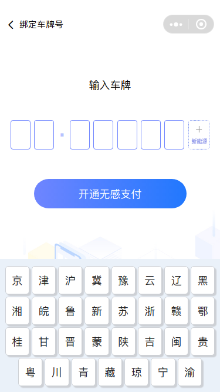

# mpvue-keyboard 基于 mpvue 的小程序虚拟键盘组件

[](https://www.npmjs.com/package/mpvue-keyboard)
[](https://www.npmjs.com/package/mpvue-keyboard)

## [更新日志](CHANGE_LOG.md)

## 效果图




## API

| 名称        | 类型    | 默认值                                                         | 描述                   |
| ----------- | ------- | -------------------------------------------------------------- | ---------------------- |
| show        | Boolean | false                                                          | 是否显示键盘           |
| plateNum    | String  | false                                                          | 实时获取输入的车牌号   |
| province    | String  | 京津沪冀豫云辽黑湘皖鲁新苏浙赣鄂桂甘晋蒙陕吉闽贵粤川青藏琼宁渝 | 省份简称键帽内容       |
| natural     | String  | 1234567890                                                     | 0-9 自然数键帽内容     |
| base-border | String  | #cccccc                                                        | 自定义输入格子边框颜色 |
| extra-key   | String  | 完成                                                           | 右下角按键内容         |

## Event

| 事件名   | 说明             | 参数                  |
| -------- | ---------------- | --------------------- |
| keyboard | 点击完成键时触发 | key: 按键所选择的内容 |

## 基本使用方法

> [可运行基于 uni-app 的基础框架查看详细例子 https://github.com/omycli/wuc](https://github.com/omycli/wuc)

-   安装

```bash
npm i mpvue-keyboard --save
```

-   使用

```html
<template>
    <div>
        <div class="bind-tit flex-center">
            <div class="bind-tit-name">输入车牌</div>
        </div>
        <keyboard
            :plateNum.sync="plateNum"
            @keyboard="keyboardChange"
            :show.sync="show"
            extraKey="立即开通"
        ></keyboard>

        <div class="w100 flex-center">
            <div class="bind-btn flex-center" @tap="openKeyBoard">
                开通无感支付
            </div>
        </div>
        <custom-bg></custom-bg>
    </div>
</template>

<script>
    import keyboard from '@/components/mpvue-keyboard/mpvue-keyboard';
    export default {
        data() {
            return {
                show: false,
                plateNum: ''
            };
        },

        components: { keyboard },

        computed: {},

        methods: {
            keyboardChange(e) {
                this.plateNum = e;
                this.navCar();
            },
            openKeyBoard() {
                if (this.plateNum && this.plateNum.length > 6) {
                    this.navCar();
                } else {
                    uni.showToast({
                        icon: 'none',
                        title: '请输入完整的车牌号',
                        mask: true,
                        duration: 2000
                    });
                }
            },
            async navCar() {}
        },

        mounted() {}
    };
</script>
<style>
    .bind-tit {
        width: 100vw;
        height: 180upx;
    }
    .bind-tit-name {
        position: relative;
        top: 70upx;
        font-family: MicrosoftYaHei;
        font-size: 36upx;
        font-weight: normal;
        font-stretch: normal;
        color: #000000;
    }
    .bind-btn {
        position: relative;
        top: 180upx;
        font-family: MicrosoftYaHei;
        font-size: 36upx;
        font-weight: normal;
        font-stretch: normal;
        color: #ffffff;
        width: 520upx;
        height: 100upx;
        background-image: linear-gradient(90deg, #6f85ff 0%, #2178fe 100%),
            linear-gradient(#000000, #000000);
        background-blend-mode: normal, normal;
        border-radius: 50upx;
    }
</style>
```
