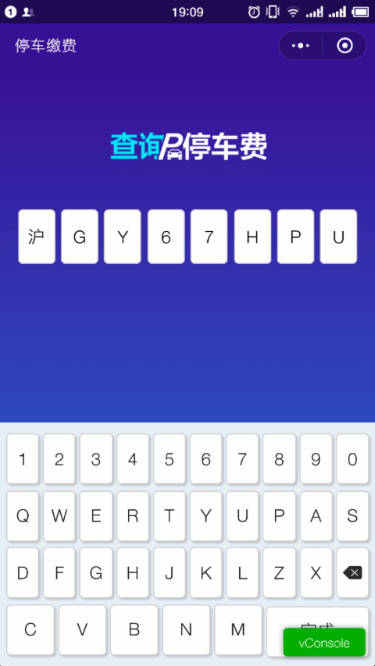
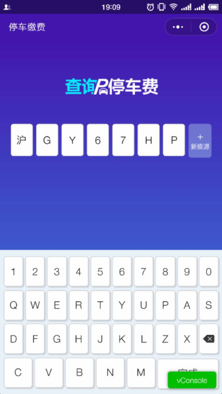

# mpvue-keyboard 基于 mpvue的小程序虚拟键盘组件

[](https://www.npmjs.com/package/mpvue-keyboard)
[](https://www.npmjs.com/package/mpvue-keyboard)

## [更新日志](CHANGE_LOG.md)

## 效果图



## API

| 名称              | 类型           | 默认值        | 描述               |
| -----------------|--------------- | ------------- | ----------------  |
| show        | Boolean         |     false         | 是否显示键盘  |
| plateNum        | String         |     false         | 实时获取输入的车牌号  |
| province        | String         | 京津沪冀豫云辽黑湘皖鲁新苏浙赣鄂桂甘晋蒙陕吉闽贵粤川青藏琼宁渝  | 省份简称键帽内容  |
| natural        | String         | 1234567890 | 0-9自然数键帽内容  |
| base-border           | String         | #cccccc   | 自定义输入格子边框颜色  |
| active-border     | String       | #ff7149          | 自定义正在输入的格子边框颜色 |
| extra-key     | String       | 完成          | 右下角按键内容 |
| inputClass        | String         |     kb-input__li flex-center         | 输入内容的展示样式的className，以空格分隔  |
| energyClass        | String         |     kb-input__new-energy         | 新能源按钮样式的className  |
| keycapClass        | String         | kb-keyboard__td-theme | 键帽样式的className  |
| alphClass        | String         | kb-keyboard__td-theme | 英文字母键帽样式的className  |
| delClass        | String         | kb-keyboard__del | 删除键帽样式的className  |
| delClass        | String         | kb-keyboard__del | 删除键帽样式的className  |
| finishedBaseClass        | String         | kb-keyboard__finished | 完成按钮默认样式的className  |
| finishedClass        | String         | kb-keyboard__finished | 完成按钮可点击时样式的className  |


## Event

| 事件名              | 说明           | 参数        |
| -----------------|--------------- | ----------------  |
| keyboard        | 点击完成键时触发         |     key: 按键所选择的内容         |

## 基本使用方法

>[可运行基础框架查看详细例子https://github.com/omycli/wuc](https://github.com/omycli/wuc)

* 安装

``` bash
npm i mpvue-keyboard --save
```

* 使用

``` vue
<template>
    <keyboard :plateNum.sync="plateNum" @keyboard="keyboardChange" :show.sync="show" extraKey="立即支付" active-border="#6f85ff" base-border="#6f85ff"></keyboard>
    <button @click="bandChange">绑定无感支付</button>
</template>

<script>
import Keyboard from 'mpvue-keyboard';
export default {
    components: {
        keyboard: Keyboard
    },
    data() {
        return {
            plateNum: ''
        };
    },
    computed: {},
    methods: {
        keyboardChange(plate) {
            this.plateNum = plate;
        },
        async bandChange() {
            console.log(this.plateNum);
        }
    },
    mounted() {}
};
</script>


```
